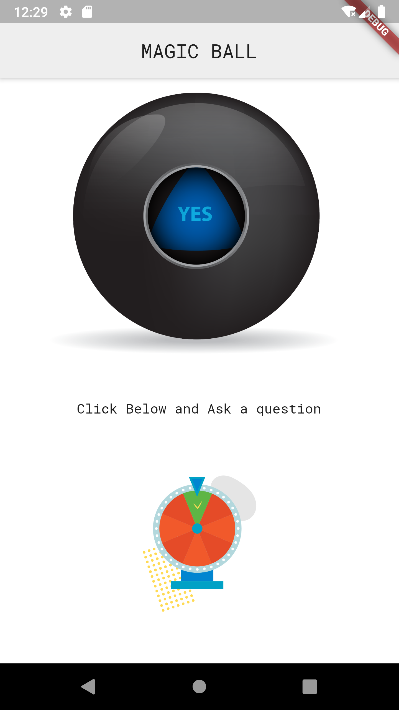

# Magic-ball app

A simple magic ball with a light theme that answers our questions . For Eg : Will I get a burger anytime soon?

# Introduction
This is app based on similar principle of the dice app
* Planing to add:
- New features that is it answers what you type after I learn more.

* The problem I faced here were:
- Not able to add icons (if someone can help it shows : Preview rendoring image as x is beyond raster. when I create an Image asset
- By mistake I added the files for andriod development that is java files there werent required, I will update the project or make it from scratch

# Visual

## Getting Started

This project is a starting point for a Flutter application.

A few resources to get you started if this is your first Flutter project:

- [Lab: Write your first Flutter app](https://flutter.dev/docs/get-started/codelab)
- [Cookbook: Useful Flutter samples](https://flutter.dev/docs/cookbook)

For help getting started with Flutter, view our
[online documentation](https://flutter.dev/docs), which offers tutorials,
samples, guidance on mobile development, and a full API reference.
